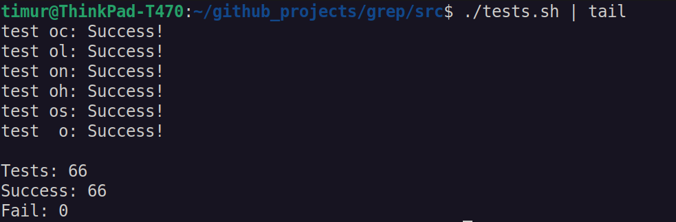
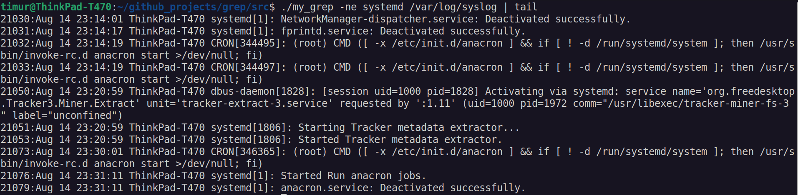

# GREP utility

## __Description of project:__
__In this project I developed my own implementation of grep text utility for Unix systems.__

Grep is a command-line utility for searching plain-text data sets for lines that match a regular expression. 

The program developed according to the principles of structured programming in C language of C11 standard using gcc compiler.

I used _regex.h_ library for regular expressions.

Integration tests cover all flag variants and input values, based on a comparison with the behavior of real utility _(I used grep from Ubuntu 22.04 to compare with)_ 

### grep Options

`grep [options] template [file_name]`

| No. | Options | Description |
| ------ | ------ | ------ |
| 1 | -e | pattern |
| 2 | -i | Ignore uppercase vs. lowercase.  |
| 3 | -v | Invert match. |
| 4 | -c | Output count of matching lines only. |
| 5 | -l | Output matching files only.  |
| 6 | -n | Precede each matching line with a line number. |
| 7 | -h | Output matching lines without preceding them by file names. |
| 8 | -s | Suppress error messages about nonexistent or unreadable files. |
| 9 | -f file | Take regexes from a file. |
| 10 | -o | Output the matched parts of a matching line. |

## __Compilation:__
Use make utility for building the library and tests.

## __Unit-tests and reports:__
Use bash script _tests.sh_ in src/ folder

## __Usage:__
